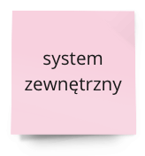

# Big picture

## Przygotowanie do warsztatu:
- Zaproszenie odpowiednich osób - jedna z **najważniejszych rzeczy w tej metodyce to zaproszenie odpowiednich osób na warsztat**. Zależy nam na osobach, które dobrze znają proces biznesowy
- Określenie celu - określenie celu warsztatu i zakresu modelowanego procesu

## Etapy warsztatu:
#### 1. **Wild exploration**
Mapowanie procesu za pomocą zdarzeń - na tym etapie zależy nam na zmapowaniu procesu biznesowego bez zachowania chronologicznego porządku zdarzeń.
#### 2. **Enforce timeline**
Porządkowanie - na tym etapie staramy się ułożyć eventy w kolejności chronologicznej zakładając
- w części centralnej główną ścieżkę modelowanego procesu
- usuwamy duplikaty
- aby zrównoleglić układanie możemy znaleźć kilka głównych zdarzeń procesu i rozłożyć je równomiernie na osi
#### 3. **Explicit walk-through**
- Przegląd w przód - jedna z uczestników warsztatu stara się opowiedzieć historię happy path - weryfikujemy w ten sposób czy nie brakuje zdarzeń w modelowanym procesie.
- Przegląd w tył - staramy się przejść główną ścieżkę procesu od końca do początku - zadajemy pytania co musiało się zdarzyć, aby zadziało się analizowane zdarzenie
#### 4. **Actors and external systems**
Dodanie aktorów i zewnętrznych systemów
- dodanie aktorów, którzy powodują wystąpienie określonych zdarzeń
- dodanie systemów zewnętrznych mogących 
## Gramatyka:

#### Zdarzenie - pomarańczowa kartka

- istotna zmiana stanu w modelowanym procesie biznesowym
- napisane w formie przeszłej dokonanej
- w konkretnym momencie czasu

#### Hot spot - różowa kartka

- wszelkie niepewności założenia, ryzyka i pytania
- staramy się powstrzymać długie dyskusje i zaadresować je w późniejszym terminie
#### Aktor - żółta kartka

#### System zewnętrzny - niebieska kartka
